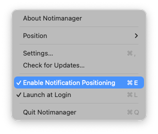

# Notimanager

**Take control of your macOS notifications.**

Notimanager gives you the power to decide where notifications appear on your screen. No more blocking your browser tabs, game HUDs, or important tools in the top-right corner.

  

## ✨ Features

- **Corner Control**: Move notifications to any of the 4 corners (Top-Left, Bottom-Left, Bottom-Right, or back to Top-Right).
- **Distraction Free**: Hide the menu bar icon for a completely invisible experience.
- **Native Design**: Built with SwiftUI to look and feel right at home on macOS.
- **Lightweight**: Uses negligible system resources.
- **Keyboard Friendly**: Fast access via menu bar shortcuts.

## 📸 Screenshots

| Position Control | Settings |
|------------------|----------|
|  |  |

## 📥 Installation

1. **[Download the latest DMG](https://github.com/abd3lraouf/Notimanager/releases/latest)**.
2. Drag **Notimanager** to your **Applications** folder.
3. Open the app and follow the prompt to grant **Accessibility Permissions** (required to move notification windows).

> **Note**: Notimanager is open-source software signed with a self-signed certificate. You may see a security prompt on first launch. Simply right-click the app and select "Open" to bypass it. [Read more in the Installation Guide](docs/INSTALLATION.md).

## 🔒 Privacy & Safety

- **Open Source**: The full source code is available here for audit.
- **No Data Collection**: Notimanager does not collect, store, or transmit any user data.
- **Offline**: The app runs entirely locally on your machine.
- **No Sandbox**: Requires exemption from App Sandbox solely to function (moving other apps' windows requires Accessibility API).

## 🔗 Resources

- **[Installation Guide](docs/INSTALLATION.md)** - Detailed setup instructions.
- **[Developer Guide](docs/DEVELOPMENT.md)** - Build from source and contribution info.
- **[Changelog](docs/CHANGELOG.md)** - Version history.

---

  Made with ❤️ for macOS
   
  © 2026 Abdelraouf Sabri

