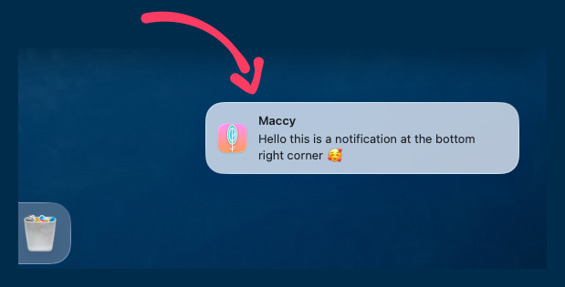
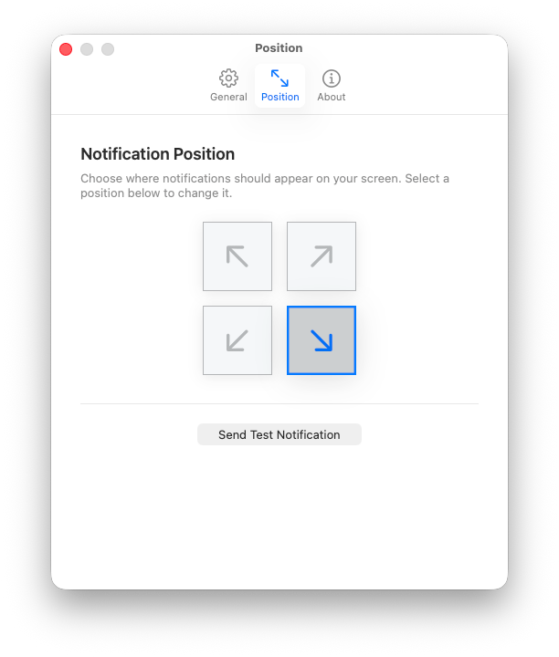
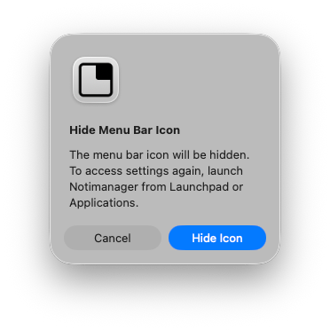

# Notimanager

Take control of your notification experience on macOS.



## Features

- **4 Corner Positions**: Place notifications in any corner of your screen (top-left, top-right, bottom-left, bottom-right)
- **Menu Bar Control**: Quick access to settings and position changes right from your menu bar
- **Launch at Login**: Optional auto-start for seamless integration
- **Test Notifications**: Verify your setup works with a single click
- **Beautiful UI**: Liquid glass design with golden ratio spacing for a modern aesthetic

## Requirements

- macOS 14.0 (Sonoma) or later

## Installation

### 📥 Download Release

[](https://github.com/abd3lraouf/Notimanager/releases/latest)
[](https://github.com/abd3lraouf/Notimanager/releases)

**DMG Installer (Recommended):**
1. Download `Notimanager-macOS.dmg` from [GitHub Releases](https://github.com/abd3lraouf/Notimanager/releases)
2. Open the DMG and drag Notimanager to Applications
3. Launch and grant Accessibility permissions

**ZIP Archive:**
1. Download `Notimanager-macOS.zip`
2. Extract and run: `xattr -cr Downloads/Notimanager.app`
3. Move to Applications: `mv Downloads/Notimanager.app /Applications/`

For detailed installation instructions and troubleshooting, see [docs/INSTALLATION.md](docs/INSTALLATION.md).

> **⚠️ Security Notice**: This app is signed with a self-signed certificate for free distribution. You may see security warnings on first launch. See [docs/INSTALLATION.md](docs/INSTALLATION.md) for step-by-step instructions.

## Usage

### Getting Started

1. **Launch Notimanager** from Applications
2. **Grant Accessibility Permissions** when prompted (required for moving notifications)
3. **Choose Your Position** from the menu bar icon
4. **Test It** with "Send Test Notification" to verify your setup

### Position Selection



Notimanager offers 4 corner positions for optimal notification placement:

- **Top Left** ⬉ - Notifications appear in the top-left corner
- **Top Right** ⬈ - Notifications appear in the top-right corner (default)
- **Bottom Left** ⬋ - Notifications appear in the bottom-left corner
- **Bottom Right** ⬊ - Notifications appear in the bottom-right corner

### Settings


Access the settings window from the menu bar icon to configure:

- **Position Selection** - Choose your preferred notification corner
- **Enable/Disable** - Toggle notification positioning on/off
- **Launch at Login** - Auto-start Notimanager when you log in
- **Hide Menu Bar Icon** - Keep Notimanager running without menu bar presence

### Menu Bar Control



Click the menu bar icon to quickly:
- Change notification position
- Enable/disable positioning
- Send test notifications
- Access settings

## Building from Source

If you prefer to build from source or want to verify the code:

### Requirements

- macOS 14.0 or later
- Xcode 15.0 or later

### Steps

1. **Clone the repository**
   ```bash
   git clone https://github.com/abd3lraouf/Notimanager.git
   cd Notimanager
   ```

2. **Open in Xcode**
   ```bash
   open Notimanager.xcodeproj
   ```

3. **Build and run**
   - Press `⌘R` to build and run in development mode
   - For release builds, select **Product → Archive** → **Distribute App** → **Copy App**

### Self-Signed Certificate

To create release builds with code signing, use the provided script:

```bash
./scripts/create-self-signed-cert.sh
```

This creates a self-signed certificate for local development and distribution.

### Build Script

Use the provided build script for streamlined development and releases:

```bash
# Show all commands
./scripts/build.sh help

# Run full release pipeline
./scripts/build.sh all

# Prepare for release (interactive)
./scripts/build.sh prepare

# Individual steps
./scripts/build.sh build     # Development build
./scripts/build.sh test      # Run tests
./scripts/build.sh clean     # Clean artifacts
./scripts/build.sh archive   # Create Xcode archive
./scripts/build.sh export    # Export app bundle
./scripts/build.sh zip       # Create ZIP distribution
./scripts/build.sh dmg       # Create DMG distribution
```

The build script handles:
- Xcode version selection
- Code signing with self-signed certificate
- Archive creation and export
- ZIP and DMG distribution (using create-dmg)
- Test execution

**Note:** DMG creation requires Node.js 18+ (automatically uses npx if needed).

### CI/CD Setup

For automated releases via GitHub Actions:

```bash
# Setup CI/CD (one-time setup)
./scripts/setup-ci.sh

# This will:
# 1. Verify/create self-signed certificate
# 2. Export to P12 format
# 3. Encode to base64
# 4. Display instructions for GitHub Secrets
```

Add these secrets to your GitHub repository:
- `SELF_SIGNED_CERTIFICATE` - Base64 encoded certificate
- `CERTIFICATE_PASSWORD` - Certificate password (default: `notimanager`)

See [docs/CICD_SETUP.md](docs/CICD_SETUP.md) for detailed CI/CD configuration.

## Development

### Running Tests

```bash
# Run all tests
xcodebuild test -scheme NotimanagerTests -destination 'platform=macOS'

# Run specific test suites
xcodebuild test -scheme NotimanagerTests -destination 'platform=macOS' \
  -only-testing:NotimanagerTests/Unit
xcodebuild test -scheme NotimanagerTests -destination 'platform=macOS' \
  -only-testing:NotimanagerTests/UI
```

### Project Structure

```
Notimanager/
├── Notimanager/              # Main app source
│   ├── Components/          # Reusable UI components
│   ├── Coordinators/        # App coordination and lifecycle
│   ├── Managers/            # Core services and managers
│   ├── Models/              # Data models
│   ├── Protocols/           # Protocol definitions
│   ├── Resources/           # Assets and resources
│   ├── Utils/               # Utility functions
│   ├── ViewModels/          # View model layer
│   └── Views/               # UI views and controllers
├── NotimanagerTests/        # Test suites
├── docs/                    # Documentation
└── scripts/                 # Build and utility scripts
```

## Permissions

Notimanager requires the following permission:

- **Accessibility**: Required to detect and move notification windows. The app cannot function without this permission.

The app:
- Does NOT have App Sandbox enabled (required for accessibility features)
- Does NOT collect or transmit any data
- Does NOT make network connections
- Runs entirely locally on your Mac

## Debugging

If notifications aren't moving:

1. **Check permissions**: System Settings → Privacy & Security → Accessibility
2. **Toggle the permission**: Turn it off, wait 2 seconds, turn it back on
3. **Restart the app**: Quit and relaunch Notimanager
4. **Check logs**: Open Console.app and filter by `dev.abd3lraouf.notimanager`

For more troubleshooting help, see [docs/INSTALLATION.md](docs/INSTALLATION.md).

## Changelog

See [docs/CHANGELOG.md](docs/CHANGELOG.md) for a list of changes in each version.

## Contributing

Contributions are welcome! Please feel free to submit issues and pull requests.

1. Fork the repository
2. Create your feature branch (`git checkout -b feature/amazing-feature`)
3. Commit your changes (`git commit -m 'Add some amazing feature'`)
4. Push to the branch (`git push origin feature/amazing-feature`)
5. Open a Pull Request

## License

© 2026 Abdelraouf Sabri. All rights reserved.

## Support

- 🐛 [Report Issues](https://github.com/abd3lraouf/Notimanager/issues)
- 💡 [Request Features](https://github.com/abd3lraouf/Notimanager/issues)
- 📖 [Documentation](docs/)
